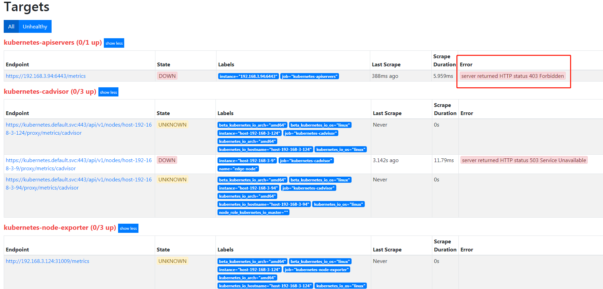
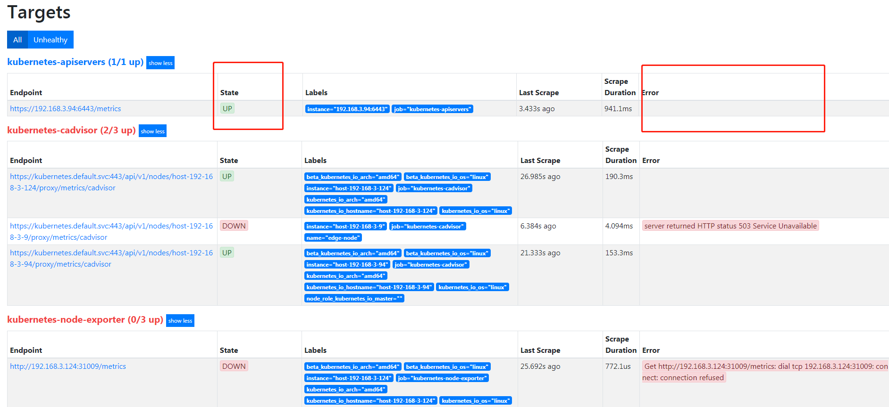

```
{
  "kind": "Status",
  "apiVersion": "v1",
  "metadata": {

  },
  "status": "Failure",
  "message": "forbidden: User \"system:anonymous\" cannot get path \"/\"",
  "reason": "Forbidden",
  "details": {

  },
  "code": 403
}
```


server returned HTTP status 403 Forbidden

这个是 prometheus对应的deploy的serviceaccount对应的clusterrole权限不足造成的

之前的配置为
```
apiVersion: rbac.authorization.k8s.io/v1
kind: ClusterRole
metadata:
  name: prometheus
rules:
- apiGroups: [""]
  resources:
  - nodes
  - services
  - endpoints
  - pods
  - nodes/proxy
  verbs: ["get", "list", "watch"]
- apiGroups: [""]
  resources:
  - configmaps
  verbs: ["get"]
- nonResourceURLs: ["/metics"]  # 对非资源型 endpoint metrics 进行 get 操作
  verbs: ["get"]
```

修改后为:
```
apiVersion: rbac.authorization.k8s.io/v1
kind: ClusterRole
metadata:
  name: prometheus
rules:
- apiGroups: [""]
  resources:
  - nodes
  - services
  - endpoints
  - pods
  - nodes/proxy
  verbs: ["get", "list", "watch"]
- apiGroups: [""]
  resources:
  - configmaps
  verbs: ["get"]
- nonResourceURLs: ["/metics"]
  verbs: ["get"]
- nonResourceURLs: ["/api/*"]
  verbs: ["get"]
```
仍然不对


改为cluster-admin去binding,状态变为正确



所以,应该是clusterrole的问题造成的


https://songjiayang.gitbooks.io/prometheus/content/pushgateway/
