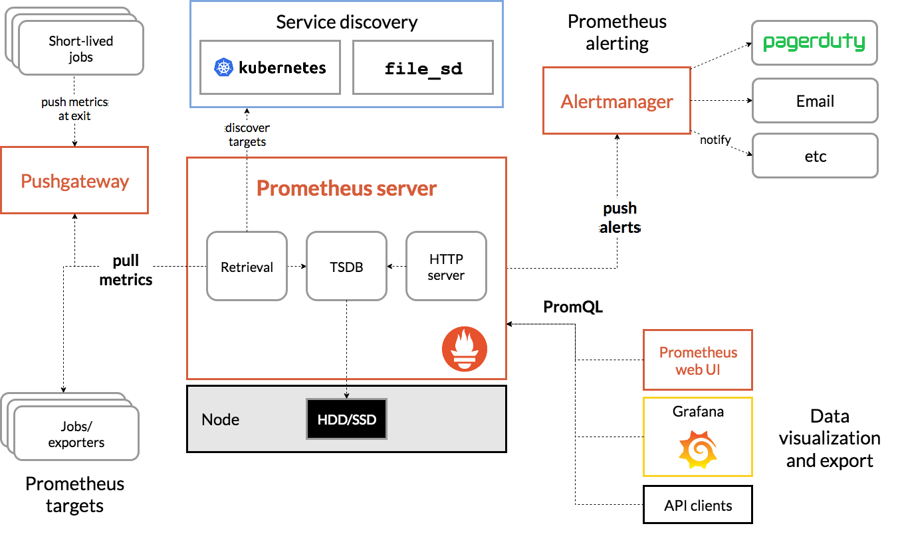

# 监控概述

## 为什么要监控
监控是整个产品周期中最重要的一环，及时预警减少故障影响免扩大，而且能根据历史数据追溯问题。
- 对系统不间断实时监控
- 实时反馈系统当前状态
- 保证业务持续性运行

## 要监控什么
可以参考：https://www.jiankongbao.com

监控项   | 监控内容
---------|:-----------------------------------------------------------------------------------------------------------------------------------
硬件监控 | 1.通过远程控制卡：Dell的IDRAC   2.IPMI（硬件管理接口）监控物理设备。 3.网络设备：路由器、交换机温度，硬件故障等。
系统监控 | CPU，内存，硬盘利用率，硬件I/O，网卡流量，TCP状态，进程数
应用监控 | Nginx、Tomcat、PHP、MySQL、Redis等，业务涉及的服务都要监控起来
日志监控 | 系统日志、服务日志、访问日志、错误日志
安全监控 | 1.可以利用Nginx+Lua实现WAF功能，并存储到ES，通过Kibana可视化展示不同的攻击类型。  2.用户登录数，passwd文件变化，其他关键文件改动
API监控  | 收集API接口操作方法（GET、POST等）请求，分析负载、可用性、正确性、响应时间
业务监控 | 例如电商网站，每分钟产生多少订单、注册多少用户、多少活跃用户、推广活动效果（产生多少用户、多少利润）
流量监控 | 根据流量获取用户相关信息，例如用户地理位置、某页面访问状况、页面停留时间等。监控各地区访问业务网络情况，优化用户体验和提升收益

## 监控方案

# 什么是Prometheus

## 架构

