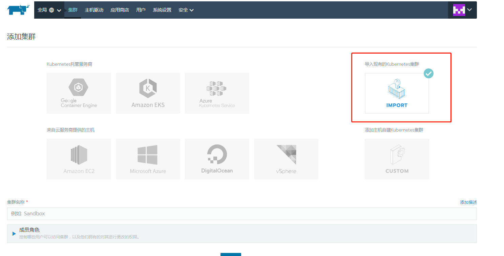
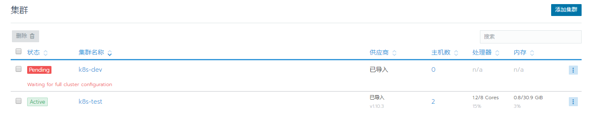
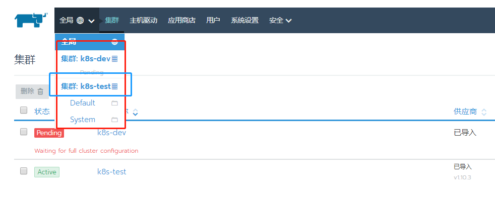

## 导入已有的集群



### 创建角色
```
# kubectl create clusterrolebinding cluster-admin-binding --clusterrole cluster-admin --user [USER_ACCOUNT]
Error from server (AlreadyExists): clusterrolebindings.rbac.authorization.k8s.io "cluster-admin-binding" already exists
```

### 在每个node节点上执行
```
[root@node1 ~]# curl --insecure -sfL https://192.168.3.27/v3/import/74gqt8ksjkv4fwjj67x24zs69d59mxpsddbs4b8g4frh7tgmcj9pcg.yaml | kubectl apply -f -
namespace "cattle-system" configured
serviceaccount "cattle" unchanged
clusterrolebinding.rbac.authorization.k8s.io "cattle-admin-binding" configured
secret "cattle-credentials-c9e9c9a" created
clusterrole.rbac.authorization.k8s.io "cattle-admin" configured
deployment.extensions "cattle-cluster-agent" created
daemonset.extensions "cattle-node-agent" created
```

### 正确导入后的状态
执行完成后，就是`pengding`的状态，过一会儿后就是`active`的状态了,说明已经正确导入了.





## 进去到某个集群中





