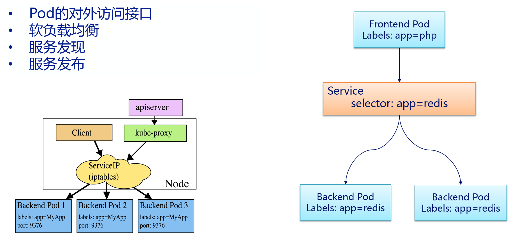

<!-- toc -->
# service

## service概述

虽然每个Pod都会被分配一个单独的IP地址，但这个IP地址会随着Pod的销毁而消失。引出的一个问题是：如果有一组Pod组成一个应用集群来提供服务，那么该如何访问它们呢？

Service就是用来解决这个问题的，一个Service可以看作一组提供相同服务的Pod的对外接口，Service是通过`LabelSelector`选择一组Pod作用后端服务提供者。

举个例子：redis运行了2个副本，这两个Pod对于前端程序来说没有区别，所以前端程序并不关心是哪个后端副本在提供服务。并且后端Pod在发生变化时，前端也无须跟踪这些变化。Service就是用来实现这种解耦的抽象概念。


如何通过Service Cluster IP访问到后端的Pod呢？Kubernetes群集中的每个节点运行kube-proxy。该程序负责对Service实现虚拟IP的实现。在 Kubernetes v1.0，代理即是纯粹在用户空间。在Kubernetes v1.1添加了iptables代理，但是并不是默认的操作模式。在Kubernetes v1.2默认用iptables代理模式。在iptables代理模式下kube-proxy会观察Kubernetes Master节点添加和删除Service对象和Endpoint对象的行为，对于每个服务，kube-proxy会在本机的iptables中安装相应的规则，iptables通过这些规则将会捕获到该Service的流量并将它们重定向到一个后端的Pod。默认情况下后, 后端的选择是随机的。

但是也可以选择基于客户端IP的sessionaffinity，可以通过设置service.spec.sessionAffinity=ClientIP(默认值为“None”)来选择该方式。与用户空间的代理一样，客户端不知道Kubernetes或Service或Pod，任何对于Service的IP:Port的访问都会被代理到后端。但是iptables的代理比用户空间代理是更快、 更可靠。

## pod的IP 与 service的IP
- Pod的IP地址是由Docker Daemon根据docker0网桥的IP地址段进行分配的
- 但Service的Cluster IP地址是Kubernetes系统中的虚拟IP地址，由系统动态分配。

Service的Cluster IP相对于Pod的IP地址来说相对稳定，Service被创建时即被分配一个IP地址，在销毁该Service之前，这个IP地址都不会再变化了。而Pod在Kubernetes集群中生命周期较短，可能被Replication Controller销毁、再次创建，新创建的Pod就会被分配一个新的IP地址。
Pods是短暂的，那么重启时IP地址可能会改变，怎么才能从前端容器正确可靠地指向后台容器呢？

Service是定义一系列Pod以及访问这些Pod的策略的一层抽象。Service通过Label找到Pod组。因为Service是抽象的，所以在图表里通常看不到它们的存在，这也就让这一概念更难以理解。

现在，假定有2个后台Pod，并且定义后台Service的名称为‘backend-service’，lable选择器为（tier=backend, app=myapp）。backend-service 的Service会完成如下两件重要的事情：
会为Service创建一个本地集群的DNS入口，因此前端Pod只需要DNS查找主机名为 ‘backend-service’，就能够解析出前端应用程序可用的IP地址。
现在前端已经得到了后台服务的IP地址，但是它应该访问2个后台Pod的哪一个呢？Service在这2个后台Pod之间提供透明的负载均衡，会将请求分发给其中的任意一个（如下面的动画所示）。通过每个Node上运行的代理（kube-proxy）完成。这里有更多技术细节。

下述动画展示了Service的功能。注意该图作了很多简化。如果不进入网络配置，那么达到透明的负载均衡目标所涉及的底层网络和路由相对先进。


## k8s中找到svc的方法
Kubernetes支持两种主要的模式来找到Service：
- 一个是容器的Service环境变量
- 另一个是DNS。

### 容器的Service环境变量
在创建一个Pod时，kubelet在该Pod的所有容器中为当前所有Service添加一系列环境变量。

Kubernetes支持形如`“{SVCNAME}SERVICE_HOST”`和`“{SVCNAME}_SERVICE_PORT”`的变量。其中“{SVCNAME}”是大写的ServiceName，同时Service Name包含的“-”符号会转化为“”符号。

例如，已存在名称为“redis-master”的Service，它对外暴露6379的TCP端口，且集群IP为10.0.0.11。kubelet会为新建的容器添加以下环境变量：
```
REDIS_MASTER_SERVICE_HOST=10.0.0.11
REDIS_MASTER_SERVICE_PORT=6379
REDIS_MASTER_PORT=tcp://10.0.0.11:6379
REDIS_MASTER_PORT_6379_TCP=tcp://10.0.0.11:6379
REDIS_MASTER_PORT_6379_TCP_PROTO=tcp
REDIS_MASTER_PORT_6379_TCP_PORT=6379
REDIS_MASTER_PORT_6379_TCP_ADDR=10.0.0.11
```
通过环境变量来创建Service会带来一个不好的结果，即任何被某个Pod所访问的Service，必须先于该Pod创建，否则和这个后创建的Service相关的环境变量，将不会被加入该Pod的容器中。

### DNS
DNS服务器通过Kubernetes API Server监控与Service相关的活动。当监控到添加Service的时，DNS服务器为每个Service创建一系列DNS记录。

例如：有个叫做”my-service“的service，它对应的kubernetes namespace为”my-ns“，那么会有它对应的dns记录，叫做”my-service.my-ns“。那么在my-ns的namespace中的pod都可以对my-service做name解析来轻松找到这个service。在其它namespace中的pod解析”my-service.my-ns“来找到它。解析出来的结果是这个service对应的cluster ip。

Service的ClusterIP地址只能在集群内部访问，如果集群外部的用户希望Service能够提供一个供集群外用户访问的IP地址。Kubernetes通过两种方式来实现上述需求，一个是“NodePort”，另一个是“LoadBalancer”。

## service的类型
- ClusterIP：使用集群内的私有ip —— 这是默认值。
- NodePort：除了使用cluster ip外，也将service的port映射到每个node的一个指定内部port上，映射的每个node的内部port都一样。
- LoadBalancer：使用一个ClusterIP & NodePort，但是会向cloud provider申请映射到service本身的负载均衡。

如果将type字段设置为NodePort，kubernetesmaster将会为service的每个对外映射的port分配一个”本地port“，这个本地port作用在每个node上，且必须符合定义在配置文件中的port范围（为–service-node-port-range）。这个被分配的”本地port“定义在service配置中的spec.ports[*].nodePort字段，如果为这个字段设定了一个值，系统将会使用这个值作为分配的本地port 或者 提示你port不符合规范。

## 几个port易混淆的概念：nodePort、port、targetPort

### nodePort

外部流量访问k8s集群中service入口的一种方式（另一种方式是LoadBalancer），即nodeIP:nodePort是提供给外部流量访问k8s集群中service的入口。

比如外部用户要访问k8s集群中的一个Web应用，那么我们可以配置对应service的type=NodePort，nodePort=30001。其它用户就可以通过浏览器http://node:30001访问到该web服务。

而数据库等服务可能不需要被外界访问，只需被内部服务访问即可，那么我们就不必设置service的NodePort。


### port
k8s集群内部服务之间访问service的入口。即clusterIP:port是service暴露在clusterIP上的端口。

mysql容器暴露了3306端口（参考DockerFile），集群内其它容器通过33306端口访问mysql服务，但是外部流量不能访问mysql服务，因为mysql服务没有配置NodePort。对应的service.yaml如下：
```
apiVersion: v1
kind: Service
metadata:
 name: mysql-service
spec:
 ports:
 - port: 33306
   targetPort: 3306
 selector:
  name: mysql-pod
```

### targetPort

容器的端口（最终的流量端口）。targetPort是pod上的端口，从port和nodePort上来的流量，经过kube-proxy流入到后端pod的targetPort上，最后进入容器。

与制作容器时暴露的端口一致（使用DockerFile中的EXPOSE），例如官方的nginx（参考DockerFile）暴露80端口。 对应的service.yaml如下：
```
apiVersion: v1
kind: Service
metadata:
 name: nginx-service
spec:
 type: NodePort         // 有配置NodePort，外部流量可访问k8s中的服务
 ports:
 - port: 30080          // 服务访问端口
   targetPort: 80       // 容器端口
   nodePort: 30001      // NodePort
 selector:
  name: nginx-pod
```
