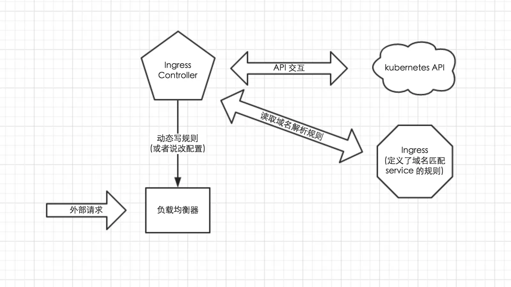

<!-- toc -->


# 集群外部服务访问--ingress

service通常只是在集群内部有效，从集群外是无法访问到的。
在kubernets的世界里，服务要对集群外暴漏，有这么几种方式：
- NodePort
- LoadBalancer
- External IPs
- Ingress


## 什么是ingress
```
# kubectl explain ingress
KIND:     Ingress
VERSION:  extensions/v1beta1

DESCRIPTION:
     Ingress is a collection of rules that allow inbound connections to reach
     the endpoints defined by a backend. An Ingress can be configured to give
     services externally-reachable urls, load balance traffic, terminate SSL,
     offer name based virtual hosting etc.
```

Ingress是一种资源，和Pod、Configmap等等类似，也需要一个controller来管理。
之前比较常用的是NodePort，搭配keepalived可以获得一定程度的HA。

NodePort、LoadBalance、External IPs可以认为是L4的，而Ingress则是L7的。

Ingress 是一组允许外部请求进入集群的路由规则的集合。它可以给 Service 提供集群外部访问的 URL，负载均衡，SSL 终止等。

Ingress 起到了智能路由的角色，外部流量到达 Ingress ，再由它按已经制定好的规则分发到不同的后端服务中去。

看起来它很像我们使用的负载均衡器之类的,和Nginx很类似。

## ingress的使用流程
ingress的使用流程是这样的：
1. 集群部署时，创建一个或多个ingress controller，他们会去监听api server
2. 当用户创建Ingress时，controller会通过api server获取新创建的Ingress的信息，主要是vhost、路径、service+port
3. 注意ingress-nginx会直接将service翻译为endpoint，减少了service这一层转换，根据nginx模板生成新的nginx配置文件（主要是proxy_pass到RS）
4. 最后reload nginx重新加载配置。

## Ingress 与 LoadBalancer 类型的 Service 的区别

- Ingress 不是一种 Service 类型
Ingress 是 K8S 中的一种资源类型，我们可以直接通过 kubectl get ingress 的方式获取我们已有的 Ingress 资源。

- Ingress 可以有多种控制器（实现）
  - 社区维护的有两个：
    - 适用于 Google Cloud 的 GLBC
    - NGINX Ingress Controller 它是使用 ConfigMap 存储 NGINX 配置实现的。
  - 第三方的实现：
    - 基于 Envoy 的 Contour;
    - F5 的 F5 BIG-IP Controller;
    - 基于 HAProxy 的 haproxy-ingress;
    - 基于 Istio 的 Control Ingress Traffic;
    - 现代化的反向代理服务器 Traefik;
    - 以及 Kong 支持的 Kong Ingress Controller for Kubernetes
    - NGINX 官方支持的 NGINX Ingress Controller。


## 使用ingress
Ingress 这个东西是 1.2 后才出现的，通过 Ingress 用户可以实现使用 nginx 等开源的反向代理负载均衡器实现对外暴露服务

使用 Ingress 时一般会有三个组件:

- 反向代理负载均衡器
- Ingress Controller
- Ingress




### 反向代理负载均衡器
反向代理负载均衡器很简单，说白了就是 nginx、apache 什么的；在集群中反向代理负载均衡器可以自由部署，可以使用 Replication Controller、Deployment、DaemonSet 等等，不过个人喜欢以 DaemonSet 的方式部署，感觉比较方便

### Ingress Controller
Ingress Controller 实质上可以理解为是个监视器，Ingress Controller 通过不断地跟 kubernetes API 打交道，实时的感知后端 service、pod 等变化，比如新增和减少 pod，service 增加与减少等；当得到这些变化信息后，Ingress Controller 再结合下文的 Ingress 生成配置，然后更新反向代理负载均衡器，并刷新其配置，达到服务发现的作用

### Ingress
Ingress 简单理解就是个规则定义；比如说某个域名对应某个 service，即当某个域名的请求进来时转发给某个 service;这个规则将与 Ingress Controller 结合，然后 Ingress Controller 将其动态写入到负载均衡器配置中，从而实现整体的服务发现和负载均衡


### ingress工作流程
从上图中可以很清晰的看到，实际上请求进来还是被负载均衡器拦截，比如 nginx，然后 Ingress Controller 通过跟 Ingress 交互得知某个域名对应哪个 service，再通过跟 kubernetes API 交互得知 service 地址等信息；综合以后生成配置文件实时写入负载均衡器，然后负载均衡器 reload 该规则便可实现服务发现，即动态映射。

了解了以上内容以后，这也就很好的说明了我为什么喜欢把负载均衡器部署为 Daemon Set；因为无论如何请求首先是被负载均衡器拦截的，所以在每个 node 上都部署一下，同时 hostport 方式监听 80 端口；那么就解决了其他方式部署不确定 负载均衡器在哪的问题，同时访问每个 node 的 80 都能正确解析请求；如果前端再 放个 nginx 就又实现了一层负载均衡。

# 部署 Traefik
官网: https://traefik.io/


由于微服务架构以及 Docker 技术和 kubernetes 编排工具最近几年才开始逐渐流行，所以一开始的反向代理服务器比如 nginx、apache 并未提供其支持，毕竟他们也不是先知；所以才会出现 Ingress Controller 这种东西来做 kubernetes 和前端负载均衡器如 nginx 之间做衔接；即 Ingress Controller 的存在就是为了能跟 kubernetes 交互，又能写 nginx 配置，还能 reload 它，这是一种折中方案；而最近开始出现的 traefik 天生就是提供了对 kubernetes 的支持，也就是说 traefik 本身就能跟 kubernetes API 交互，感知后端变化

**在k8s 1.6版本上部署,需要3个yaml文件**
- rbac.yaml ： 用于创建相应的权限
- daemonset.yaml ： 真正的controller
- treafikui.yaml ： 监控treafik的ui

## rbac.yaml
```
apiVersion: v1
kind: ServiceAccount
metadata:
  name: ingress
  namespace: kube-system

---

kind: ClusterRoleBinding
apiVersion: rbac.authorization.k8s.io/v1beta1
metadata:
  name: ingress
subjects:
  - kind: ServiceAccount
    name: ingress
    namespace: kube-system
roleRef:
  kind: ClusterRole
  name: cluster-admin
  apiGroup: rbac.authorization.k8s.io
```

可以部署为deployment,也可以部署为`daemonset`,在这儿我选择的是`daemonset`

## daemonset.yaml
```
apiVersion: extensions/v1beta1
kind: DaemonSet
metadata:
  name: traefik-ingress-lb
  namespace: kube-system
  labels:
    k8s-app: traefik-ingress-lb
spec:
  template:
    metadata:
      labels:
        k8s-app: traefik-ingress-lb
        name: traefik-ingress-lb
    spec:
      terminationGracePeriodSeconds: 60
      hostNetwork: true
      restartPolicy: Always
      serviceAccountName: ingress
      containers:
      - image: traefik:v1.6
        name: traefik-ingress-lb
        resources:
          limits:
            cpu: 200m
            memory: 80Mi
          requests:
            cpu: 100m
            memory: 50Mi
        ports:
        - name: http
          containerPort: 80
          hostPort: 80
        - name: admin
          containerPort: 8580
          hostPort: 8580
        args:
        - --web
        - --web.address=:8580
        - --kubernetes
      nodeSelector:
        edgenode: "true"
```

**traefik 监听 node 的 80 和 8580 端口，80 提供正常服务，8580 是其自带的 UI 界面，原本默认是 8080，因为环境里端口冲突了，所以这里临时改一下**

注意有个label
```
nodeSelector:
  edgenode: "true"
```
**所以需要在部署的节点上打上这个label**

## treafikui.yaml
```
apiVersion: v1
kind: Service
metadata:
  name: traefik-web-ui
  namespace: kube-system
spec:
  selector:
    k8s-app: traefik-ingress-lb
  ports:
  - name: web
    port: 80
    targetPort: 8580
---
apiVersion: extensions/v1beta1
kind: Ingress
metadata:
  name: traefik-web-ui
  namespace: kube-system
spec:
  rules:
  - host: k8sig.com
    http:
      paths:
      - path: /
        backend:
          serviceName: traefik-web-ui
          servicePort: web
```


访问traefikui的地址: http://k8sig.com/dashboard/


**注意: traefik是有namespace隔离的!**
