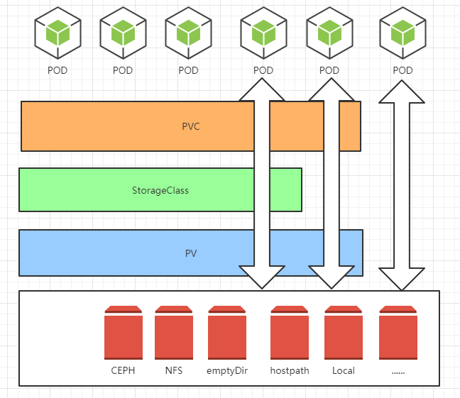

<!-- toc -->
# 一、基本概念
容器中的存储都是临时的，因此Pod重启的时候，内部的数据会发生丢失。实际应用中，我们有些应用是无状态，有些应用则需要保持状态数据，确保Pod重启之后能够读取到之前的状态数据，有些应用则作为集群提供服务。这三种服务归纳为无状态服务、有状态服务以及有状态的集群服务，其中后面两个存在数据保存与共享的需求，因此就要采用容器外的存储方案。下图为存储的概念图：


## 1. Kubernetes中存储中有四个重要的概念：
* Volume
    * Volumes是最基础的存储抽象，其支持多种类型，包括本地存储、NFS、FC以及众多的云存储，也可以编写自己的存储插件来支持特定的存储系统。Volume可以被Pod直接使用，也可以被PV使用。普通的Volume和Pod之间是一种静态的绑定关系，在定义Pod的同时，通过volume属性来定义存储的类型，通过volumeMount来定义容器内的挂载点。
* PV (PersistentVolume )
    * 与普通的Volume不同，PV是Kubernetes中的一个资源对象，创建一个PV相当于创建了一个存储资源对象，这个资源的使用要通过PVC来请求。
* PVC (PersistentVolumeClaim )
    * PVC是用户对存储资源PV的请求，根据PVC中指定的条件Kubernetes动态的寻找系统中的PV资源并进行绑定。目前PVC与PV匹配可以通过`StorageClassName`、`matchLabels`或者`matchExpressions`三种方式。
* StorageClass
    * PV与PVC的绑定的前提是需要先将PV创建出来，否则pvc的状态一直会是`pending`。如果需要动态的进行PV的创建的时候，我们就可以使用storageclass了。

## 2. POD使用存储的方法：
* 可以直接使用存储
* 可以使用PVC+PV+存储
* 可以使用PVC+SC+PV+存储

## 3. 用通俗易懂的话讲volume：
* Volume就是存储，和pod同生共死的。Volume有很多种类，包括：emptydir、hostpath、local。对于需要持久化的业务需求，基本不能满足要求。
* PV就是包装了一层的存储，独立于pod的生命周期，专注于分布式存储，满足需要持久化的需求。
* PVC就是用户的请求，和PV进行绑定，在没有使用SC的情况下需要PV创建了才会绑定，否则状态一直是`pending`，(绑定的时候判断依据是访问方式和容量大小)。
* SC就是用来支持动态的创建PV，当有用户创建的PVC后，动态创建PV自动与PVC进行绑定(绑定的时候判断依据是访问方式和容量大小)。


*****
动态的创建PV是一个难点,接下来将演示怎么配置storageclass,以动态的方式创建PV
# 二、nfs-storageclass的配置过程


## 1. 配置nfs
### 1.1 查看hosts配置
```
[root@k8s-master ~]# cat /etc/hosts
127.0.0.1   localhost localhost.localdomain localhost4 localhost4.localdomain4
192.168.3.6 k8s-master
192.168.3.25 k8s-node1
192.168.3.26 k8s-node2
192.168.3.22 k8s-node3
```
从上面可以看到我的master节点的名字叫做 `k8s-master` ，在这儿我也准备将nfs的server部署到这个节点上。

### 1.2 配置一块盘用作nfs
我用的是lvm进行管理的，在这个地方挂载了一个目录为`/nfsdisk`,大小为50G的目录作为nfs磁盘
```
[root@k8s-master ~]# df -h
Filesystem                                    Size  Used Avail Use% Mounted on
/dev/vda1                                      34G   15G   20G  43% /
devtmpfs                                       16G     0   16G   0% /dev
tmpfs                                          16G   84K   16G   1% /dev/shm
tmpfs                                          16G  137M   16G   1% /run
tmpfs                                          16G     0   16G   0% /sys/fs/cgroup
/dev/mapper/dockerlocal_vg-dockerlocal_lv_01   99G  3.2G   91G   4% /dockerlocal
tmpfs                                         1.6G   16K  1.6G   1% /run/user/42
/dev/mapper/dockerlocal_vg-nfsdisk             50G   53M   47G   1% /nfsdisk
```

### 1.3 服务端配置


#### 1.3.1 进行nfs的相关配置
```
# vim /etc/exports
# cat /etc/exports
/nfsdisk 192.168.3.0/24(rw,no_root_squash,no_all_squash,sync)
```

#### 1.3.2 安装相关包
```
yum install -y nfs-utils
```

#### 1.3.3 开始相关服务自启动
```
systemctl enable rpcbind.service
systemctl enable nfs-server.service
systemctl start rpcbind.service
systemctl start nfs-server.service
```

#### 1.3.4 检查
```
[root@k8s-master ~]# rpcinfo -p
   program vers proto   port  service
    100000    4   tcp    111  portmapper
    100000    3   tcp    111  portmapper
    100000    2   tcp    111  portmapper
    100000    4   udp    111  portmapper
    100000    3   udp    111  portmapper
    100000    2   udp    111  portmapper
    100005    1   udp  20048  mountd
    100005    1   tcp  20048  mountd
    100005    2   udp  20048  mountd
    100005    2   tcp  20048  mountd
    100005    3   udp  20048  mountd
    100005    3   tcp  20048  mountd
    100024    1   udp  50252  status
    100024    1   tcp  54712  status
    100003    3   tcp   2049  nfs
    100003    4   tcp   2049  nfs
    100227    3   tcp   2049  nfs_acl
    100003    3   udp   2049  nfs
    100003    4   udp   2049  nfs
    100227    3   udp   2049  nfs_acl
    100021    1   udp  51608  nlockmgr
    100021    3   udp  51608  nlockmgr
    100021    4   udp  51608  nlockmgr
    100021    1   tcp  42493  nlockmgr
    100021    3   tcp  42493  nlockmgr
    100021    4   tcp  42493  nlockmgr
[root@k8s-master ~]# exportfs
/nfsdisk      	192.168.3.0/24
```


### 1.4 客户端配置(每个节点都要配置)
在相应的3个节点进行配置

#### 1.4.1 安装相关包并开启服务
```
yum install -y nfs-utils
systemctl enable rpcbind.service
systemctl start rpcbind.service
```

#### 1.4.2 查看挂载的情况
```
[root@k8s-node2 ]# showmount -e k8s-master
Export list for k8s-master:
/nfsdisk 192.168.3.0/24
```

## 2. 配置StorageClass
参考:https://github.com/kubernetes-incubator/external-storage/tree/master/nfs-client
配置StorageClass需要配置三个地方:
- rbac：创建一个sa,专门用于nfs的,所以权限那一块要给够
- deployment：部署有关nfs的storageclass的一个pod，要注意上一步的ServiceAccount和PVC的写法
- storageclass： 声明sc的相关信息

### 2.1 rbac
rbac.yaml
```
kind: ServiceAccount
apiVersion: v1
metadata:
  name: nfs-client-provisioner
---
kind: ClusterRole
apiVersion: rbac.authorization.k8s.io/v1
metadata:
  name: nfs-client-provisioner-runner
rules:
  - apiGroups: [""]
    resources: ["persistentvolumes"]
    verbs: ["get", "list", "watch", "create", "delete"]
  - apiGroups: [""]
    resources: ["persistentvolumeclaims"]
    verbs: ["get", "list", "watch", "update"]
  - apiGroups: ["storage.k8s.io"]
    resources: ["storageclasses"]
    verbs: ["get", "list", "watch"]
  - apiGroups: [""]
    resources: ["events"]
    verbs: ["create", "update", "patch"]
---
kind: ClusterRoleBinding
apiVersion: rbac.authorization.k8s.io/v1
metadata:
  name: run-nfs-client-provisioner
subjects:
  - kind: ServiceAccount
    name: nfs-client-provisioner
    namespace: default
roleRef:
  kind: ClusterRole
  name: nfs-client-provisioner-runner
  apiGroup: rbac.authorization.k8s.io
---
kind: Role
apiVersion: rbac.authorization.k8s.io/v1
metadata:
  name: leader-locking-nfs-client-provisioner
rules:
  - apiGroups: [""]
    resources: ["endpoints"]
    verbs: ["get", "list", "watch", "create", "update", "patch"]
---
kind: RoleBinding
apiVersion: rbac.authorization.k8s.io/v1
metadata:
  name: leader-locking-nfs-client-provisioner
subjects:
  - kind: ServiceAccount
    name: nfs-client-provisioner
    namespace: default
roleRef:
  kind: Role
  name: leader-locking-nfs-client-provisioner
  apiGroup: rbac.authorization.k8s.io
```

当然也可以偷懒给一个最大的cluster-admin的权限，如：
```
apiVersion: v1
kind: ServiceAccount
metadata:
  name: scpvcsa
  namespace: default
---
apiVersion: rbac.authorization.k8s.io/v1
kind: ClusterRoleBinding
metadata:
  name: admin-nfs
roleRef:
  apiGroup: rbac.authorization.k8s.io
  kind: ClusterRole
  name: cluster-admin
subjects:
- kind: ServiceAccount
  name: scpvcsa
  namespace: default
```

### 2.2 storageclass
sc.yaml
```
apiVersion: storage.k8s.io/v1
kind: StorageClass
metadata:
  name: managed-nfs-storage
provisioner: fuseim.pri/ifs # or choose another name, must match deployment's env PROVISIONER_NAME'
parameters:
  archiveOnDelete: "false"
```

### 2.3 deployment
```
kind: Deployment
apiVersion: extensions/v1beta1
metadata:
  name: nfs-client-provisioner
spec:
  replicas: 1
  strategy:
    type: Recreate
  template:
    metadata:
      labels:
        app: nfs-client-provisioner
    spec:
      serviceAccountName: nfs-client-provisioner
      containers:
        - name: nfs-client-provisioner
          image: 192.168.3.6:8888/private/nfs-client-provisioner:latest
          imagePullPolicy: IfNotPresent
          volumeMounts:
            - name: nfs-client-root
              mountPath: /persistentvolumes
          env:
            - name: PROVISIONER_NAME
              value: fuseim.pri/ifs
            - name: NFS_SERVER
              value: 192.168.3.6
            - name: NFS_PATH
              value: /nfsdisk
          imagePullSecrets:
          - name: harborsecret
      volumes:
        - name: nfs-client-root
          nfs:
            server: 192.168.3.6
            path: /nfsdisk
```

### 2.4 创建及测试
#### 2.4.1 创建
```
[root@k8s-master softdb]# ls sc_config/
deployment.yaml  rbac.yaml  sc.yaml
[root@k8s-master softdb]# kubectl create -f sc_config/
deployment.extensions/nfs-client-provisioner created
serviceaccount/nfs-client-provisioner created
clusterrole.rbac.authorization.k8s.io/nfs-client-provisioner-runner created
clusterrolebinding.rbac.authorization.k8s.io/run-nfs-client-provisioner created
role.rbac.authorization.k8s.io/leader-locking-nfs-client-provisioner created
rolebinding.rbac.authorization.k8s.io/leader-locking-nfs-client-provisioner created
storageclass.storage.k8s.io/managed-nfs-storage created
```

```
[root@k8s-master softdb]# kubectl get pod |grep nfs
nfs-client-provisioner-6594988b5b-297b8   1/1       Running            0          44m
[root@k8s-master softdb]# kubectl describe pod nfs-client-provisioner-6594988b5b-297b8
Name:           nfs-client-provisioner-6594988b5b-297b8
Namespace:      default
Node:           k8s-node1/192.168.3.25
Start Time:     Thu, 27 Dec 2018 16:13:02 +0800
Labels:         app=nfs-client-provisioner
                pod-template-hash=2150544616
Annotations:    <none>
Status:         Running
IP:             10.2.19.6
Controlled By:  ReplicaSet/nfs-client-provisioner-6594988b5b
Containers:
  nfs-client-provisioner:
    Container ID:   docker://994664692a1cc69519c988bbcbda658dfe9bf3c3325d3fce446902f34d5f7528
    Image:          192.168.3.6:8888/private/nfs-client-provisioner:latest
    Image ID:       docker-pullable://192.168.3.6:8888/private/nfs-client-provisioner@sha256:4c16495be5b893efea1c810e8451c71e1c58f076494676cae2ecab3a382b6ed0
    Port:           <none>
    Host Port:      <none>
    State:          Running
      Started:      Thu, 27 Dec 2018 16:19:27 +0800
    Ready:          True
    Restart Count:  0
    Environment:
      PROVISIONER_NAME:  fuseim.pri/ifs
      NFS_SERVER:        192.168.3.6
      NFS_PATH:          /nfsdisk
    Mounts:
      /persistentvolumes from nfs-client-root (rw)
      /var/run/secrets/kubernetes.io/serviceaccount from nfs-client-provisioner-token-cn4kl (ro)
Conditions:
  Type              Status
  Initialized       True
  Ready             True
  ContainersReady   True
  PodScheduled      True
Volumes:
  nfs-client-root:
    Type:      NFS (an NFS mount that lasts the lifetime of a pod)
    Server:    192.168.3.6
    Path:      /nfsdisk
    ReadOnly:  false
  nfs-client-provisioner-token-cn4kl:
    Type:        Secret (a volume populated by a Secret)
    SecretName:  nfs-client-provisioner-token-cn4kl
    Optional:    false
QoS Class:       BestEffort
Node-Selectors:  <none>
Tolerations:     <none>
Events:
  Type     Reason          Age                 From                Message
  ----     ------          ----                ----                -------
  Normal   Scheduled       44m                 default-scheduler   Successfully assigned default/nfs-client-provisioner-6594988b5b-297b8 to k8s-node1
  Normal   Pulling         43m (x4 over 44m)   kubelet, k8s-node1  pulling image "192.168.3.6:8888/private/nfs-client-provisioner:latest"
  Warning  Failed          43m (x4 over 44m)   kubelet, k8s-node1  Failed to pull image "192.168.3.6:8888/private/nfs-client-provisioner:latest": rpc error: code = Unknown desc = Error resp
onse from daemon: Get https://192.168.3.6:8888/v2/: http: server gave HTTP response to HTTPS client  Warning  Failed          43m (x4 over 44m)   kubelet, k8s-node1  Error: ErrImagePull
  Warning  Failed          42m (x7 over 44m)   kubelet, k8s-node1  Error: ImagePullBackOff
  Normal   BackOff         39m (x20 over 44m)  kubelet, k8s-node1  Back-off pulling image "192.168.3.6:8888/private/nfs-client-provisioner:latest"
  Normal   SandboxChanged  39m                 kubelet, k8s-node1  Pod sandbox changed, it will be killed and re-created.
  Normal   Pulling         38m                 kubelet, k8s-node1  pulling image "192.168.3.6:8888/private/nfs-client-provisioner:latest"
  Normal   Pulled          38m                 kubelet, k8s-node1  Successfully pulled image "192.168.3.6:8888/private/nfs-client-provisioner:latest"
  Normal   Created         38m                 kubelet, k8s-node1  Created container
  Normal   Started         38m                 kubelet, k8s-node1  Started container

```
#### 2.4.2 测试
创建一个PVC，查看是否能动态的创建PV
test-pvc.yaml
```
kind: PersistentVolumeClaim
apiVersion: v1
metadata:
  name: test-claim
  annotations:
    volume.beta.kubernetes.io/storage-class: "managed-nfs-storage"
spec:
  accessModes:
    - ReadWriteMany
  resources:
    requests:
      storage: 1Mi
```

```
[root@k8s-master softdb]# kubectl create -f test-pvc.yaml
persistentvolumeclaim/test-claim created
[root@k8s-master softdb]# kubectl get sc,pvc,pv
NAME                                              PROVISIONER      AGE
storageclass.storage.k8s.io/managed-nfs-storage   fuseim.pri/ifs   14m

NAME                               STATUS    VOLUME                                     CAPACITY   ACCESS MODES   STORAGECLASS          AGE
persistentvolumeclaim/test-claim   Bound     pvc-b51ca970-09b0-11e9-ada0-525400f9dfac   1Mi        RWX            managed-nfs-storage   32s

NAME                                                        CAPACITY   ACCESS MODES   RECLAIM POLICY   STATUS    CLAIM                STORAGECLASS          REASON    AGE
persistentvolume/pvc-b51ca970-09b0-11e9-ada0-525400f9dfac   1Mi        RWX            Delete           Bound     default/test-claim   managed-nfs-storage             31s
```

可以看到在创建了名为`test-claim`的PVC后，动态的创建出了名为`pvc-b51ca970-09b0-11e9-ada0-525400f9dfac `的PV,它使用的storageclass正是之前创建的scstorageclass`managed-nfs-storage`
