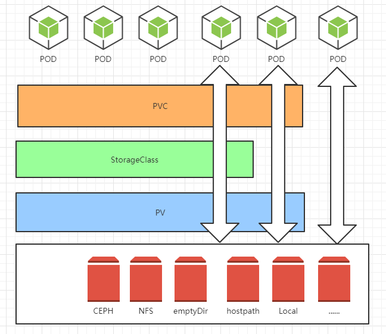

## 1.基本概念
容器中的存储都是临时的，因此Pod重启的时候，内部的数据会发生丢失。实际应用中，我们有些应用是无状态，有些应用则需要保持状态数据，确保Pod重启之后能够读取到之前的状态数据，有些应用则作为集群提供服务。这三种服务归纳为无状态服务、有状态服务以及有状态的集群服务，其中后面两个存在数据保存与共享的需求，因此就要采用容器外的存储方案。下图为存储的概念图：

## 2. Kubernetes中存储中有四个重要的概念：
* Volume
    * Volumes是最基础的存储抽象，其支持多种类型，包括本地存储、NFS、FC以及众多的云存储，也可以编写自己的存储插件来支持特定的存储系统。Volume可以被Pod直接使用，也可以被PV使用。普通的Volume和Pod之间是一种静态的绑定关系，在定义Pod的同时，通过volume属性来定义存储的类型，通过volumeMount来定义容器内的挂载点。
* PV (PersistentVolume )
    * 与普通的Volume不同，PV是Kubernetes中的一个资源对象，创建一个PV相当于创建了一个存储资源对象，这个资源的使用要通过PVC来请求。
* PVC (PersistentVolumeClaim )
    * PVC是用户对存储资源PV的请求，根据PVC中指定的条件Kubernetes动态的寻找系统中的PV资源并进行绑定。目前PVC与PV匹配可以通过`StorageClassName`、`matchLabels`或者`matchExpressions`三种方式。
* StorageClass
    * PV与PVC的绑定的前提是需要先将PV创建出来，否则pvc的状态一直会是`pending`。如果需要动态的进行PV的创建的时候，我们就可以使用storageclass了。

## 3. POD使用存储的方法：
* 可以直接使用存储
* 可以使用PVC+PV+存储
* 可以使用PVC+SC+PV+存储

## 4. 用通俗易懂的话讲volume：
* Volume就是存储，和pod同生共死的。Volume有很多种类，包括：emptydir、hostpath、local。对于需要持久化的业务需求，基本不能满足要求。
* PV就是包装了一层的存储，独立于pod的生命周期，专注于分布式存储，满足需要持久化的需求。
* PVC就是用户的请求，和PV进行绑定，在没有使用SC的情况下需要PV创建了才会绑定，否则状态一直是`pending`，(绑定的时候判断依据是访问方式和容量大小)。
* SC就是用来支持动态的创建PV，当有用户创建的PVC后，动态创建PV自动与PVC进行绑定(绑定的时候判断依据是访问方式和容量大小)。